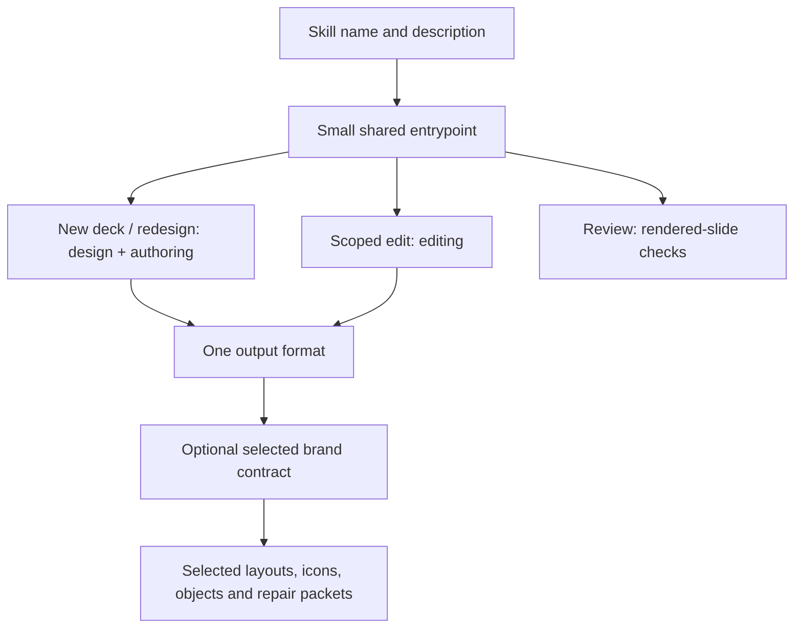

# Harness Slides

Create and improve **editable Google Slides and PowerPoint decks** with Codex,
Claude Code, Cursor or another coding agent. Give the AI a brief, source documents
or an existing deck. It develops the story and design; you do not need to write
a slide outline or JSON file.

For an existing deck, choose brand-only, polish, redesign while retaining
content, or full rework. Target the whole deck or selected slides. A brand add-on
such as Tanzu Brand supplies its identity, templates, typography and icons.

## Install

You need Node.js 20+ (and Python 3.9+ for PowerPoint inspection). Clone this repo,
then run the ordinary shell installer:

```sh
git clone https://github.com/dbbaskette/harness-slides-skill.git
cd harness-slides-skill
bash scripts/Install-Harness-Slides.sh --dry-run
bash scripts/Install-Harness-Slides.sh
```

It installs one shared package with discovery links for Codex, Claude Code and
Cursor. Existing unrelated skills are preserved. For editable PowerPoint
authoring, run the dependency command printed by the installer. Google
operations and inspection/review helpers do not load these render libraries.

Then ask your agent, for example:

> Use harness-slides to turn these documents into a 10-minute launch deck.
> Use our brand template, preserve the evidence, and visually review every slide.

Google Slides is the default. [Google access](references/google-slides.md)
explains connector/browser, gcloud and Drive fallback options. Google login is
only needed for Google operations; the local workflow works without an account.

## What it provides

- Native editable text, shapes, tables and diagrams; PowerPoint chart data and
  notes; linked Sheets charts for Google Slides.
- Template inspection and native slide reuse, working copies, scoped changes,
  evidence coverage and preservation checks.
- A local preview studio for selecting objects and editing text/geometry.
- Durable versions and restore, stale-edit protection and compact repair packets.
- Per-slide rendering/review records tied to the exact artifact and image hashes.

HTML previews share the scene's geometry but approximate native text metrics.
They are drafts. The final PowerPoint/Google render needs visual inspection;
unsupported conversions stop rather than flatten a slide into an image.

## Commands

Run `node scripts/harness-slides.mjs --help` for complete options. The agent owns
scene/patch files; these commands also make its work inspectable and repeatable.

| Command | Purpose |
| --- | --- |
| `doctor` | Check local tools; Google probes are optional |
| `workspace init`, `build`, `status` | Create a deck workspace and native output |
| `studio --project DIR` | Open the printed local preview/editing URL |
| `workspace history`, `restore`, `save` | Durable versions with conflict checks |
| `workspace repair --slide ID` | Compact context for an individual slide repair |
| `pptx inspect`, `patch`, `compare` | Scoped edits and source preservation |
| `pptx compose`, `template inspect`, `choose` | Reuse and route real templates |
| `layouts --query WORDS --limit 3` | Query focused composition patterns |
| `google copy`, `snapshot`, `previews` | Working copies and native Google review |
| `drive export`, `import` | PPTX conversion fallback |
| `review` | Render/cache slides and record actual visual findings |
| `icons copy --plan FILE` | Copy native icon geometry from an add-on's library |

Try a local example after `npm ci --ignore-scripts`:

```sh
node scripts/harness-slides.mjs workspace init --project ./example-work --file examples/scene.json --format pptx
node scripts/harness-slides.mjs workspace build --project ./example-work
node scripts/harness-slides.mjs studio --project ./example-work
```

## How context stays small



<!-- CONTEXT-USAGE:START -->
Measured with `cl100k_base`; cumulative whole-file instruction counts.

| Reading path | Tokens |
| --- | ---: |
| Discovery metadata | 40 |
| Activated entrypoint | 545 |
| Scoped PPTX edit + final review | 1,642 |
| New PPTX deck + final review | 1,983 |
| New Google deck + final review | 2,437 |

Intake, workspace and brand integration guides load only when needed; brand
contracts and query results add task-dependent context.
<!-- CONTEXT-USAGE:END -->

These are instruction-loading counts, not total conversation usage. Source
documents, tool responses and rendered images vary by task. Runtime code/assets
are executed or queried, not automatically loaded into model context. Maintainers
run `npm run context:update` after guidance changes; `context:check` catches drift.

## Development and verification

`npm test` runs the engine, preservation, Google fixtures, installer and studio
checks. Use `npm run ci:local` for the shared Tart/macOS test suite, including real
browser interaction and LibreOffice rendering in a disposable clone. See
[verification](docs/verification.md) for scope and results. No live Google or model
account is required by tests. [Implementation plan](docs/implementation-plan.md)
records the separation and source-reviewed patterns.
