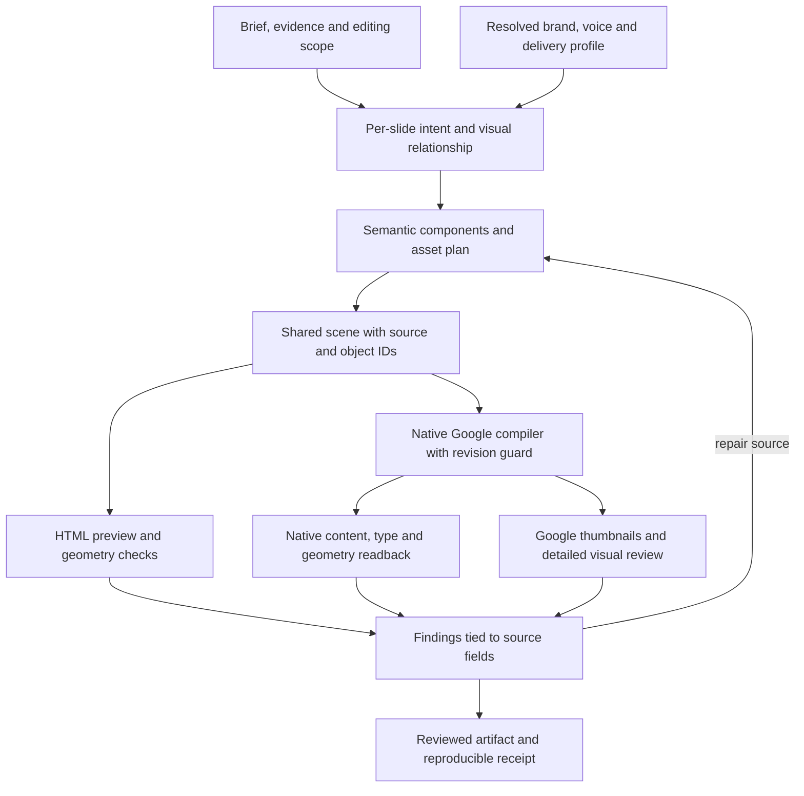

# Google Slides quality, shared brand contracts, and HTML-to-PPTX decisions

Research date: October 7, 2026. Status: decision support, not an approved implementation plan.

## Recommended direction

Keep Harness Slides' shared scene and native output architecture. Improve the
content-to-composition stage, target-specific typography, asset handling, and
native verification. Use HTML as an authoring aid and review surface. Introduce
HTML import as a bounded adapter when an existing HTML deck is the input; do not
make arbitrary HTML → PPTX → Google Slides the normal creation pipeline.

Adopt Brandkit's separation of visual identity and language, with a stronger
implementation suited to Tanzu Brand: canonical structured visual data,
generated human-readable design guidance, separately maintained organization
and author voices, and profiles for each medium. This can support both blogs
and slides without creating another independently maintained brand system.

The three decisions are connected. Better HTML styling does not automatically
produce better native slides. A reusable brand contract should feed the slide
planner and both native renderers; each slide still needs its own composition
decision, based on its argument and evidence.

| Decision | Recommendation | Confidence and condition |
| --- | --- | --- |
| Replace Harness Slides with Google Slides Generator? | Borrow selected patterns; retain our preservation and transport layers. | High confidence in architectural overlap; no comparative visual benchmark performed. |
| Expand Brandkit's design/voice idea? | Yes, through Tanzu Brand adapters and existing canonical data. | High confidence that the visual material fits; organization voice needs evidence and editorial decisions. |
| Make generic HTML-to-PPTX the primary renderer? | No, given our native-editability and Google requirements. | Source and historical experiments support this; a constrained importer remains worth testing. |
| Which converter deserves a new experiment? | `dom-to-pptx` first for HTML import; retain GX and Hasasasa as comparison candidates. | This is a source-based shortlist, not a proven fidelity ranking. |
| Where should quality work start? | Content-driven components, explicit native text/table geometry, native visual and semantic checks. | These address current gaps directly and benefit both formats. |

## Scope and evidence

This report combines fresh public source inspection, official Google/Microsoft/
W3C documentation, local Harness Slides and Tanzu Brand inspection, and the
earlier Tanzu Brand converter experiments. It expands the
[initial feature roadmap](2026-10-07-presentation-skills-roadmap.md).

Nine public repositories were fetched into temporary checkouts and inspected
without installing dependencies or executing their programs. Their commits,
inspected-file hashes, and links are recorded in the
[source ledger](2026-10-07-deep-research-sources.json). The principal Google,
Brandkit, GX, and Hasasasa snapshots match the commits in the October 6 research.
The historical converter findings therefore concern those same snapshots, but
are still historical results, not newly reproduced results. [Earlier experiments][local-history].

Harness Slides was examined at `3ad89ccf35afc3c37e04cfab5abc9635418a6cf8`
plus the existing local guidance changes. Tanzu Brand was examined from the
local checkout with HEAD `495dacf744618a40c829cccef9f38018a4ab496d`.
File hashes in the ledger identify the inspected local state independently of
HEAD. Local companion-project links require a checkout beside this repository;
they are not public distribution dependencies.

Evidence labels used below:

- **Observed:** behavior or a limitation visible in inspected source.
- **Documented:** a project claim or official API behavior.
- **Historical:** a result recorded in the previous local experiment.
- **Proposed:** our recommendation, example contract, or future acceptance test.

No new Google presentation was created, no account was authenticated, and no
cross-editor render benchmark was run. Features declared in a schema are not
assumed to be implemented correctly in every renderer. A test file is evidence
of intended coverage, not proof that its live tests ran.

## 1. Google Slides Generator: overlap and useful techniques

### Architecture and boundaries

The inspected project separates an AI-authored Markdown brief from a
deterministic engine. A typed scene owns geometry and identity; HTML and native
Google requests are outputs. It offers fourteen layout functions, including
comparison, process, metrics, chart, timeline, ecosystem, and executive summary.
The scene carries object IDs, provenance, accessibility descriptions, explicit
z-order, and native/fallback declarations. [Scene contract][g-scene],
[layout implementation][g-layouts], [compiler][g-compiler].

Harness Slides already has the central architecture: a common scene, HTML
preview, native PPTX objects, Google compilation, version history, source
coverage, and artifact-bound visual review. Its generic layout catalog currently
contains prose recipes rather than executable composition functions. It also
has stronger existing-deck safeguards than a new-deck publisher alone provides:
working copies, explicit replace/protect sets, revision preconditions, and
preserved-object comparisons. [Our recipes][h-layouts],
[Google compiler and preservation][h-google], [review][h-review].

The useful transfer is not another independent engine. It is a better contract
between semantic slide planning, reusable components, and native target behavior.

### Techniques to adopt or adapt

| Technique | Source evidence | Harness Slides application |
| --- | --- | --- |
| Semantic content contracts for layouts | Layout functions and narrative validation require particular data shapes. | Components should accept actual comparisons, stages, intervals, or measures; reject missing evidence rather than fill with invented content. |
| Target-aware text allocation | Shared inset budgets and a multiline safety factor account for Google wrapping. | Add measured content boxes, explicit vertical alignment and paragraph spacing, calibrated for the actual target page and font. |
| Browser geometry audit | DOM bounds are compared with scene bounds; text scroll dimensions and image loading are checked. | Detect preview bugs early, but retain Google-rendered review. |
| Explicit table styling | Compiler specifies header/body colors, alignment and borders. | Avoid Google defaults; also solve the table positioning issue below. |
| Staged native requests | Creation, content, style, grouping and stacking are ordered separately. | Add groups and clear paint order while retaining existing revision protection. |
| Separate native and visual evidence | Readback and thumbnails answer different questions. | Verify object types/content/data and actual appearance independently. |
| Localized visual drift | Changed pixels are attributed to scene-node bounds. | Produce a repair packet naming affected slide/object IDs and source fields. |
| Asset resolution boundary | Google image URLs are resolved separately from local scene assets. | Keep asset sourcing, authorized publication/insertion, and scene compilation separate. |

Sources: [narrative contracts][g-narrative], [text model][g-text-box],
[fit heuristic][g-text-fit], [DOM audit][g-render-audit],
[native styling][g-requests], [compiler][g-compiler],
[readback][g-readback], [diff attribution][g-diff], [asset boundary][g-assets].

### Important limitations in the inspected source

**Text fitting is heuristic.** The algorithm estimates wrapped lines from
character lengths and average glyph widths, then tries smaller sizes down to a
floor. The static collision check predicts the next overlapping text region.
This is useful screening, not a full font-shaping or Google text-layout engine.
Keep the headroom idea, but prefer actual font measurements and fix allocation
before reducing type. [Fit implementation][g-text-fit], [static audit][g-static].

**Font-family declarations do not prove the font rendered.** The DOM audit
compares the computed `font-family` string with the requested family. A CSS stack
can still name a missing font while the browser paints a fallback. We should
combine font availability checks, known measurement probes, and target-rendered
inspection rather than copy this check as a font guarantee. [DOM audit][g-render-audit].

**Its bar charts are shapes.** The chart layout builds rectangles, labels and a
baseline, not a linked Sheets chart. It uses absolute magnitudes for bar heights
and a minimum visible height. Without additional constraints, negative values or
zero values can communicate incorrectly. Borrow grouping and label hierarchy;
do not adopt that routine as a general quantitative chart renderer. Use explicit
numeric data, signs, units, scales and source checks. [Chart code][g-layouts].

**Its table creation does not establish placement.** The compiler supplies
geometry in `createTable`; the inspected styling function does not subsequently
position the table or specify column/row dimensions. Google documents that
creation ignores requested size and transform. Our compiler does set column
widths and row minimum heights, but likewise lacks a subsequent positioning
request in that branch. This is a high-confidence source/API mismatch to verify
with a focused native fixture, not a newly observed live defect. [Generator
compiler][g-compiler], [table styles][g-requests], [our compiler][h-google],
[Google table behavior][api-tables].

**Editability counts are not full semantic equivalence.** Readback gathers actual
kinds and IDs, but the editability assessment increments expected kinds when IDs
exist. It does not compare every expected kind, text value, table cell, transform
or chart source. Our current type/preservation checks are valuable; extend them
with content and geometry comparisons rather than replacing them with ID counts.
[Readback][g-readback], [assessment][g-editability], [our readback checks][h-google].

**Global diff thresholds are specific to its environment.** Its postpublish
gate uses an 8% changed-pixel limit, while normalizing thumbnails to 1920×1080.
Google's documented large thumbnail is 1600 pixels wide; enlarging it does not
create extra detail. A small missing unit or clipped numeral can fit inside a
good whole-slide score. Calibrate thresholds locally, compare at a common real
resolution, and require high-risk region checks. [Postpublish gate][g-post],
[thumbnail normalization][g-thumbnails], [official thumbnails][api-thumbnails].

**Background contrast screening is incomplete.** Its static audit selects the
highest lower-z solid shape covering a text box's center. That is useful for
simple panels, but does not establish contrast across text on photos, gradients,
partially overlapping panels or transparent artwork. We should evaluate the
effective surface over the relevant region and flag uncertain cases for review.
[Static implementation][g-static].

**Its narrative constraints are not universal.** Required agenda/section roles
and restricted layout/data combinations may suit a longer executive deck but
should not force a five-slide update or an existing deck into the same sequence.
Separate narrative advice from hard structural requirements. [Narrative rules][g-narrative].

The repository's live smoke test is conditional on credentials and an environment
flag. It checks a small slide and native-kind counts, not a complete brand/template
or visual-fidelity benchmark. [Live test][g-live].

The schema's rotation and accessibility fields also need an end-to-end contract
test: the inspected native element-property function does not apply rotation,
and the compiler does not emit native alt-text updates from those descriptions.
This reinforces the distinction between storing metadata and delivering it.
[Scene fields][g-scene], [native properties][g-requests], [compiler][g-compiler].

### Google-specific practices grounded in official documentation

1. **Read the actual canvas.** Keep our point-based scene coordinates and map
   any browser canvas proportionally to the native page. Do not copy a fixed
   pixel-to-point factor from another project. Imported templates have their
   own dimensions and transforms. [Transforms][api-transforms].
2. **Set text behavior explicitly.** Google permits writes of only unspecified
   or `NONE` autofit. Text-affecting updates can deactivate inherited autofit.
   Set font size, paragraph spacing, alignment and allocation deliberately; do
   not rely on API-controlled shrinking or growing. [Autofit reference][api-autofit].
3. **Create tables, then configure and verify them.** Allocate native column
   widths, minimum row heights, cell text, padding/style where supported, and
   table position through supported subsequent operations. Read back actual
   geometry because row minimums are not guaranteed final heights. [Tables][api-tables],
   [request reference][api-requests].
4. **Keep quantitative charts linked when future data edits matter.** Create
   the backing chart in Sheets, insert it with `LINKED`, and refresh after source
   updates. Record the backing spreadsheet/chart and snapshot used for review.
   Linked data needs appropriate account access and scope; a `drive.file`-only
   publisher is not automatically sufficient for every chart workflow.
   [Official chart workflow][api-charts].
5. **Use real connector relationships.** Google supports straight, bent and
   curved connectors with start/end connection references. Groups and tables
   are not connection targets. Model semantic node IDs and valid connection
   sites; test that relationships survive a node move. [Lines][api-lines].
6. **Treat speaker notes as separate native content.** Resolve the notes shape
   via `speakerNotesObjectId` and edit its text. Preserve supplied notes; only
   create new narration within the requested scope. Our generic scene compiler
   currently rejects notes, although native tools can handle them.
   [Notes API][api-notes], [our compiler][h-google].
7. **Batch dependent changes, protect revisions, inspect uncertain writes.**
   Google validates and atomically applies requests within one batch in order.
   Several slide batches are not one deck-wide transaction. If we adopt resumable
   per-slide builds, save a journal and readback state without weakening our
   revision guard or retrying uncertain creations blindly. [Batch guarantees][api-batch],
   [our Google workflow][h-google-guide].
8. **Render the destination.** Compare reviewed preview geometry with actual
   native thumbnails, then inspect native structure. Download thumbnail bytes
   promptly; URLs expire and grant access to the image, so keep them out of public
   reports. Bind review to scene, native revision, assets, fonts and renderer
   versions. [Thumbnail reference][api-thumbnails], [current review][h-review].
9. **Start from approved native templates for brand fidelity.** Duplicate rich
   exemplars or appropriate layouts and replace their content slots. Importing
   the approved PPTX template once is different from routing every new deck
   through HTML and PPTX conversion. Re-resolve object IDs and inspect the imported
   native template. [Google template merge pattern][api-merge],
   [existing Harness guidance][h-google-guide].

### Proposed Google quality pipeline



Proposed acceptance: one benchmark contains a comparison, timeline, signed/zero
quantitative chart, table with unequal columns and long cells, connected diagram,
annotated screenshot, quote, and simple statement. Every slide must communicate
its own relationship and retain intended native semantics. The benchmark should
also include an existing-deck preservation case.

## 2. Brandkit and Tanzu Brand: a shared visual/language contract

### What Brandkit contributes

Brandkit treats visual and language guidance as distinct contracts, records
where identity values came from, and checks whether output remains recognizable
with its logo removed. Its companion Voiceprint skill derives writing profiles
from actual samples. These are useful concepts for reuse across media.
[Brandkit][b-kit], [Voiceprint][b-voice].

Brandkit itself is chiefly instructions. Its render route targets self-contained
HTML and checks color/font declarations. It is not a Google Slides or PPTX
renderer, an identity-asset verifier, or a complete brand-compliance system.
Its rule to write any user correction straight into global design guidance
should not become our organizational policy. A deck preference may be local.
[Brandkit instructions][b-kit].

### Can our captured material be represented as design?

**Yes, most visual material already has a better structured representation than
a handwritten DESIGN.md.** Tanzu Brand has canonical tokens, selected identity
profiles, measured presentation geometry, asset/font manifests, native layouts,
component catalogs, accessibility rules, and operational checks. A design
document can provide an intelligible view of these, with links to their authority.
It should not flatten large catalogs or duplicate manually maintained values.
[Tokens][t-tokens], [brand rules][t-rules], [presentation profile][t-profile],
[profile guidance][t-system], [skill routing][t-skill].

| Captured material | Proposed contract representation | Authority and boundary |
| --- | --- | --- |
| Brand identity and version | Identity record, selected brand/variant, source revision | Retain Tanzu/VMware/Broadcom selection; product names alone do not select identity. |
| Palette and semantic roles | Structured token references plus resolved colors in the render bundle | Retain one canonical token source; a raw swatch is not a universal text or status role. |
| Typography and exact font requirement | Family/style rules and target font-availability evidence | Keep preview fallback distinct from final compliance. |
| Shape language and accent treatment | Visual rules with examples and rule severity | Square cards, legitimate circles, restrained accents are different rules. |
| Native title/content/footer geometry | Presentation profile with units and safe regions | Preserve measured authority separately from adjustable editorial defaults. |
| Type sizes, spacing, chart/table treatments | Medium-specific role scales and component inputs | Slide point sizes do not become blog CSS sizes. |
| Logos, wordmarks, approved variants | Asset registry, checksum, usage/background constraints | Link to exact assets; prose cannot replace byte-level identity checks. |
| Functional icons | Concept search and native-copy references | Preserve licensed geometry and approved recoloring rules. |
| Imagery and screenshot guidance | Sourcing/treatment policy and asset provenance | Do not fabricate product evidence or apply palette restrictions to every photo pixel. |
| Accessibility | Resolved pair thresholds, alt-text and reading-order requirements | Check final output; a token list alone is insufficient. |
| Sentence case and official names | Shared language policy consumed by voice and medium profiles | Preserve compatibility with current token consumers during migration. |
| Blog tone and author style | Organization voice plus a selected author profile | Requires actual approved writing evidence; cannot be inferred from slide colors. |
| Video bumpers and timing | Video profile and approved asset references | Keep out of blog and slide defaults unless relevant. |
| Layout/icon/example libraries | Indexed references queried by meaning | Fetch selected entries; do not load catalogs into every prompt. |
| Source history and exceptions | Provenance and scope-bound exception records | One-off output corrections do not automatically redefine the brand. |

The locally inspected Tanzu core contains language rules for headline casing and
official names, but those do not amount to a full editorial voice. This observation
does not establish that no richer voice exists in private Blog Studio or another
approved source. Discover and reuse such profiles before creating replacements.
[Language tokens][t-tokens], [language guidance][t-rules].

### Proposed extension: more useful than two standalone files

Separate four concerns:

1. **Visual identity:** canonical token and asset data; shared visual rules.
2. **Language identity:** organization naming, tone, terminology, claim strength,
   prohibited wording, examples, and approved evidence sources.
3. **Author voice:** an optional individual register, selected for attributed
   writing or narration, with organization rules still applicable.
4. **Medium and audience:** live talk, reading deck, blog, web page, or video;
   owns layout mechanics, copy density, notes, timing, and delivery constraints.

Proposed package shape, not a migration performed by this research:

```text
brand/
  tokens.json                 canonical visual values and role bindings
  asset-manifest.json         approved identity and content asset records
  font-manifest.json          approved fonts and availability evidence
  DESIGN.md                  generated view of visual data and visual rules
  VOICE.md                   curated organization language contract
  profiles/
    slides.json               references existing presentation profiles
    blog.json                 blog-specific visual/editorial application
  voices/
    author-profile.md         selected only for an authorized author voice
  resolved/
    task-contract.json        derived, versioned input for a particular task
```

Keep existing profile paths initially; this shape explains responsibility rather
than demanding a filesystem reorganization. DESIGN.md can link to profiles and
catalogs. It need not inline every layout, icon, measurement or asset.

The resolved task contract should record selected brand/variant, canonical
revisions/hashes, active voice, medium/audience, asset identities, hard rules,
adjustable defaults, and scoped exceptions. Both blog and slide workflows consume
that contract through a small adapter. Rendering code resolves tokens; the agent
receives the selected human-readable rules and relevant examples.

### Language authority and conflict handling

Proposed precedence: approved organization identity/naming requirements, explicit
task constraints and authorized exceptions, selected author voice, then medium
defaults. Preserve literal quotations and supplied evidence. If a task asks for
a departure from an immutable organizational rule, record the conflict instead
of quietly modifying global policy.

A blog can use an author's sentence rhythm while retaining product names and
substantiated claims. A slide can use a concise assertion heading and short
diagram labels, while speaker notes carry a fuller register. The style of a long
blog paragraph should not be imposed on slide body copy.

Use positive and negative examples supported by real approved writing. Record
unknown language decisions as unknown; absence of a phrase in a small sample
does not prove it is prohibited. Establish a new company voice only after
reviewing the relevant company sources. This adapts Voiceprint's evidence-based
profiling without imposing its sample-count and universal banned-word rules on
every Tanzu task. [Voiceprint source][b-voice].

### What to add beyond Brandkit

| Addition | Why it matters | Proposed validation |
| --- | --- | --- |
| Schema-backed resolved contracts | Agents and renderers receive the same authority. | A token revision changes both generated design guidance and output resolution. |
| Rule severity and scope | Distinguish immutable logos from adjustable slide copy budgets. | A layout exception cannot bypass an identity checksum failure. |
| Organization/author voice composition | Blogs and slides share brand language without erasing author style. | Same source facts in a blog, slide headline, and notes retain names/claims but adapt length. |
| Per-medium profiles | Web rhythm, slide geometry, and video pacing are different. | Blog settings never silently change slide font sizes or footer clearance. |
| Native adapters | Apply visual roles to PPTX, Google and HTML. | Inspect final styles and rendered output in each target. |
| Provenance and versioned handoff | Resumed work can reproduce prior brand decisions. | Saving/resuming retains selected authority unless an update is requested. |
| Explicit policy-change workflow | Keep local output corrections from changing organization rules. | A deck correction produces a local override; promotion is a separate maintainer action. |
| Signature composition examples | Recognizable branding goes beyond putting a logo on a generic grid. | Review with logos hidden while preserving factual content and appropriate layout choices. |
| Structured brand review | Source grep misses inherited styles, transparency, images, native objects and behavior. | Combine source checks, identity verification and rendered judgment. |

Do not adopt Brandkit's HTML-only delivery, mandatory rereading of every file on
each render, or a second independent palette. Hash and reuse unchanged context;
invalidate derived artifacts when authority changes. Keep one simple agent
entrypoint and hide contract mechanics from first-time users.

## 3. HTML-to-PPTX: which path is best for our requirements?

### Separate authoring from conversion

HTML is attractive because agents can use browser layout tools, rich typography,
and quick previews. Its usefulness as a design environment does not establish
fidelity in PowerPoint, Google Slides, or editable data structures. Our decision
must consider both pixels and the editing operations users need afterward.

| Path | Main advantage | Main cost | Recommended role |
| --- | --- | --- | --- |
| Semantic plan → shared scene → native PPTX/Google; HTML preview | One meaning/geometry contract; controlled native mapping and preservation | Components and target-specific QA must be built deliberately | Primary path for new decks and substantial redesigns |
| Constrained HTML → semantic importer → shared scene | Reuses existing HTML while retaining our downstream checks | Only declared structures can be imported faithfully | Optional import path for a supported HTML dialect |
| Arbitrary browser DOM/CSS → PPTX converter | Rapid export of existing web decks | Style gaps, text metrics, lost chart/table relationships and more fallback | Opt-in import/export experiment; not normal Google generation |
| HTML → PPTX → Google import | One PPTX export serves two destinations | Two translation stages; native Google data/link behavior needs repair | Compatibility fallback when native Google access is unavailable |
| Slide screenshots → PPTX/Google images | Predictable pixels from the browser | Essential content loses editability, data and reading structure | Explicit appearance-only output or approved scoped decorative fallback |

The first two are compatible. A constrained HTML importer can resolve into our
scene instead of becoming another renderer or source of truth. Existing deck
polish/brand-only edits continue to use native preservation paths.

### Converter findings

#### GX HTML2PPTX

**Observed:** Chromium extracts DOM/CSS and SVG into intermediate SVG; Python
converts primitives to DrawingML. Its DOM walker handles simple backgrounds,
borders, text and SVG, and patches ECharts into SVG mode. The inspected walker
has no general HTML `` emission branch. Text is emitted by wrapped line;
SVG arrow-marker attributes are removed during normalization. These details
help explain why object counts alone are a poor fidelity gate.
[Skill][x-gx-skill], [extractor][x-gx-extract].

**Historical:** the local experiment lost supplied icon imagery/footer and
native table/chart data semantics despite producing a usable PPTX. Keep these
results scoped to the tested fixture and recorded revision.
[Historical comparison][local-history].

**Useful techniques:** retain intermediate representations for debugging,
measure text with a browser canvas, normalize supported SVG geometry, and map
simple vectors to native objects. **Boundary:** editable chart paths are not an
editable chart data model; a default Font Awesome subset is not our approved
brand icon library. Best treated as a vector conversion reference or a bounded
import candidate.

#### Hasasasa HTML to editable PPTX

**Observed:** a multi-stage pipeline measures browser elements, assembles PPTX,
handles fonts, then produces structural and visual audit artifacts. Simple
content stays native; difficult decoration can become a separate raster layer
with text retained above it. Repairs use a working HTML copy. The assembler
dispatches text, shape, SVG, canvas, decoration snapshot and image records; there
is no native table/chart assembly branch. Its assembler assumes 1920×1080.
[Workflow][x-hasa-skill], [assembler][x-hasa-assemble].

**Historical:** the tested table became ordinary text, and the experiment found
canvas/typography/effects differences. Its prior passing tests did not establish
fidelity for the actual brand fixture. [Earlier experiment][local-history].

**Useful techniques:** keep original input untouched, expose conversion-risk
preflight, classify fallbacks by element, produce side-by-side native/browser
renders, and invalidate incremental caches on shared style/font changes.
Do not copy its default cleanup of audit evidence or font downloads/installation
as invisible render behavior. Its audit workflow is not an instruction to add
delegation or extra questions to ours.

Its audit prompt also assumes that most pages should pass and asks reviewers to
suppress findings when a batch has many. We should not copy that bias or its
universal numerical tolerances. Ignore harmless antialiasing differences, but
evaluate every actual content, identity or geometry defect on its impact; do not
cap the number of legitimate findings. [Audit prompt][x-hasa-audit].

#### dom-to-pptx

**Observed:** browser computed geometry/styles feed PptxGenJS. There is native
table extraction and `addTable`, rich text handling, margin normalization, notes,
font handling, and paths that snapshot pseudo-elements. SVGs can be inserted as
vectors; the README describes a subsequent PowerPoint conversion-to-shape step.
That step is not equivalent to initially emitting native diagram nodes or chart
data. [Implementation][x-dom-engine], [README][x-dom-readme].

This deserves the first new converter experiment because native tables and
computed geometry address real requirements. It remains a candidate, not the
winner: source inspection did not establish native chart generation, attached
diagram relationships, brand-master preservation or Google import fidelity.
Its universal fidelity/font claims require target-editor evidence.

Its companion skill's enforced atmospheric styling, rounded imagery, automatic
layout alternation, and tight universal copy limits conflict with Tanzu rules
and content-driven slides. Adopt technical insights such as style support
boundaries and preflight; do not import its aesthetic defaults.
[Companion skill][x-dom-skill].

#### mk-present

**Observed:** its PPTX skill explicitly supports selected semantic presets,
parses HTML into a small intermediate model, and pairs each preset with native
mapping and QA. Unsupported slide families need a new preset. This is close to
the constrained-import approach we should consider, but its two named preset
families do not establish broad conversion support. [PPTX skill][x-mk-skill].

**Useful technique:** extraction, rendering and validation should share one
content contract. Prefer semantic comparison rows, nodes, arrows, and text roles
over arbitrary selectors and raw CSS. Adapt this into Harness components and
an optional importer instead of adding a parallel preset engine.

### Other listed skills with useful information

| Reference | Useful technique | How to adapt it |
| --- | --- | --- |
| [Presentation Skill][p-skill] | Semantic planning/evidence IDs, same-content auditions, reproducible figures and focused repairs | Make per-slide decisions executable; preview uncertain treatments using real content; retain evidence and rebuild inputs. |
| [agent-slides critique][p-critique] | Separates narrative/visual relationship critique from technical auditing | A chart that fits can still make the wrong argument; evaluate title support and visual relationships independently. |
| [Frontend Slides][p-frontend] | Fast browser previews and overflow/panel inspection | Useful for interactive HTML output and design auditions; it does not by itself establish native Google/PPTX delivery. |
| [PPTX Builder][p-builder] | Sample actual templates; explicitly choose shape/palette treatments and check logos against backgrounds | Use selected native template measurements and approved logo variants; reject mandatory icons as a universal rule. |
| [office-kit/pptx][p-office] | Read/edit/write preservation and validation-oriented tooling | Investigate native package compatibility checks, without replacing current preservation merely for another preview surface. |
| [Anthropic PPTX][p-anthropic] | Inspection, placeholder cleanup, package validation and rendered QA patterns | Use as research context; our NOTICE records that this service-licensed skill is not incorporated. |

The historical UI UX Pro Max `brand` subskill also supplied compact brand
summaries and token-conflict/asset checks. Its old file was not retrievable in
the preceding review; its attribution here rests on the saved historical
report, not a newly inspected live implementation. [Earlier brand review][local-history].

### What counts as editable?

Proposed capability levels should be reported by object, not just by deck:

| Object | Required editing behavior | Insufficient substitute |
| --- | --- | --- |
| Text | Edit words and runs while retaining intended styles | Outlined glyphs or a picture of text |
| Table | Edit cells, rows/columns and formatting | Aligned text boxes or a table screenshot |
| Quantitative chart | Edit source values and rebuild/refresh labels and geometry | A cluster of individually editable bar shapes |
| Diagram | Edit labeled nodes and preserve connector relationships | An SVG image that can later be ungrouped |
| Icon | Reuse approved native geometry or disclose a movable image | An unsupported icon font that silently substitutes |
| Photo/screenshot | Move/crop an identified source image, retaining provenance | Claiming its internal pixels are natively editable |
| Template chrome | Retain masters, approved artwork, relevant placeholders and footer behavior | Repainting a similar-looking logo/footer in HTML |

The intended level is task-dependent. A decorative texture can be rasterized
without flattening essential content. Native text and data should not be
sacrificed to preserve a shadow. Avoid ranking converters by fewest pictures or
most shapes: legitimate photographs are pictures, and thousands of paths can be
less maintainable than one well-structured native diagram.

## 4. Quality practices independent of the renderer

### Decide from each slide's content

For each slide, record the takeaway, evidence, relationship, chosen treatment,
asset purpose, and reading path. This is an internal design record, not another
form the user must fill in. Choose the treatment before writing arbitrary
coordinates. A shared theme can keep typography, semantic colors, spacing,
identity and recurring anchors stable while the content area changes.

| Content relationship | Treatments to consider | Evidence guard |
| --- | --- | --- |
| Order or dependency | Flow, timeline, numbered steps | Order must actually matter; preserve dependencies. |
| Components and interaction | Architecture layers or node/connector diagram | Edges and boundaries need meaning. |
| Choices across criteria | Matrix or aligned comparison | Compare the same criteria and preserve caveats. |
| Independent categories | Grouped boxes, labels or meaningful icons | Do not invent a rank by adding numbers. |
| Quantitative result | Appropriate chart, metric and interpretation | Verify signs, units, denominators, scales and source data. |
| Product behavior | Real screenshot with editable annotations | A generated image cannot establish product functionality. |
| Quote or central statement | Restrained typography and attribution | Images/icons are optional; attribution must be supported. |
| Explanation of an unfamiliar concept | Diagram, illustration or selected/generated image | Preserve label editability and distinguish illustration from evidence. |

Assertion-evidence guidance supports message headings backed by visual evidence
and moving secondary detail into notes for a talk. It is a useful starting point
for evidence slides, not a reason to force every agenda, reference page, or quote
into a chart/image layout. [Penn State guidance][practice-assertion].

### Typography, space and accessibility

Use role-based type and spacing rather than one size for all text. Separate
headlines, body, diagram labels, metrics, sources and captions; evaluate them at
the intended delivery scale. A live talk and a reading deck need different
density. Recompose or expand allocation before shrinking content; do not delete
important qualifiers simply to satisfy a word budget.

Use W3C's 4.5:1 normal-text and 3:1 large-text contrast criteria as a measurable
baseline, with the appropriate size definition in final output units. Higher
contrast can improve projected readability, but this research does not validate
a universal percentage loss under projection. Check text against its actual
surface; label categories directly rather than relying only on color.
[W3C contrast guidance][practice-contrast].

Accessibility also involves unique/useful titles, alt text, table meaning and
reading order. A visual reading path is not proof that assistive technology reads
objects in that order. Inspect the delivered editor's accessibility features,
and do not claim full accessibility based only on contrast and native object
counts. [Google accessibility guidance][practice-google-a11y],
[Microsoft presentation guidance][practice-ms-a11y].

Font embedding is not a cross-editor guarantee. Microsoft documents font
embeddability restrictions and differences between character subsets and full
embedding for editing. Fonts, supported embedding, and target applications need
explicit verification; preserve Tanzu's exact-family requirement.
[Microsoft font guidance][practice-fonts].

### Separate the quality gates

| Gate | What it should establish | What it cannot establish alone |
| --- | --- | --- |
| Content/evidence | Critical claims, values, units and caveats survive correctly | Attractive layout |
| Composition | Treatment communicates the slide's relationship and takeaway | Package/API validity |
| Geometry/typography | Bounds, wrapping, spacing and collision behavior are sound | Truth of the underlying claim |
| Brand | Correct identity assets, resolved roles and scoped policy | Persuasive narrative |
| Native structure | Actual text/table/chart/group types and intended editing operations | Pixel fidelity |
| Native rendered review | Target appearance, local defects and deck coherence | Complete data/relationship retention |
| Preservation | Untargeted content, notes, links, masters and protected objects survive | Whether a redesigned slide is better |

Automated checks should name affected objects and source fields. Human/agent
visual judgment should remain explicit. Existing contact sheets and revision/hash
receipts are strengths to retain, not missing features to rebuild.

## 5. Proposed experiments before architectural commitments

### Experiment A: native Google quality slice

Use disposable synthetic content and an approved local template copy. Add or
prototype a small set of content-driven components, then exercise native text,
tables, linked charts, grouping, notes and connectors. Record the actual page
size, font environment, source and native revisions. Any live Google test needs
authorization for its account and writes; this report performs no such writes.

Acceptance criteria:

- Long labels and multiline text fit without shrinking below the selected
  delivery profile; units and qualifiers remain visible.
- A table appears at its intended position with unequal column widths, readable
  cells and correct native table semantics.
- Negative/zero/positive quantitative values retain sign, units and scale;
  changing a backing value and refreshing updates the chart correctly.
- Moving a diagram node preserves valid attached relationships.
- Notes and accessibility descriptions are present as intended, with supplied
  notes and untargeted native objects preserved.
- Every reviewed render and native readback belongs to the same artifact state.

### Experiment B: brand contract across blog and slides

Resolve one existing Tanzu visual profile into generated DESIGN guidance. Reuse
an approved existing voice if one is available; otherwise create an explicitly
incomplete draft contract rather than inventing company tone. Produce the same
small factual story as a blog excerpt, two slides, and speaker notes.

Verify canonical token resolution, asset integrity, official naming, justified
differences in density/register, and context size. Introduce a synthetic token
change and a local output preference: the first should invalidate derived views;
the second should not change organizational policy. Compare logos-hidden samples
for recognizable visual identity.

### Experiment C: controlled HTML converter comparison

Compare the existing native path with dom-to-pptx, GX and Hasasasa using the same
content/approved assets. Include mk-present for a fixture within its supported
preset, without presenting that narrow result as general conversion coverage.
Use two fixture sets: constrained supported HTML and realistic browser HTML with
complex features. Keep authored facts fixed and disclose necessary source changes.

| Fixture | Defect or semantic loss to look for |
| --- | --- |
| Mixed runs, long text, inline labels and CJK text | Font/weight substitution, wrapping, dropped text, line-fragment editing |
| Approved native/SVG icons, local photos and transparent logos | Missing assets, color/alpha changes, incorrect crop and aspect ratio |
| Table with unequal columns and long cells | Flattened cells, row expansion, lost header semantics |
| Data chart with zero/negative values and a caveat | Raster/vector-only chart, scale/sign errors, lost data or qualifier |
| Architecture with connectors and groups | Broken arrows, lost attachment, excessive fragmented paths |
| Fixed footer/master and notes | Lost native template behavior, footer collisions, missing notes |
| Gradient/shadow/crop/pseudo-element | Unreported fallback or missing effects; essential content flattened |
| Second canvas size and font revision | Hardcoded scaling or stale incremental cache |

Inspect PPTX package structure, actual PowerPoint/LibreOffice render where
available, and Google import only if authorized. Record versions and target
editor differences separately. A LibreOffice pass does not certify PowerPoint
or Google fidelity. Keep audit artifacts and exact inputs; use the existing
local CI infrastructure for execution if this experiment is approved later.

Hard requirements: no omitted essential content, no altered official artwork,
the declared native data/diagram/table editing operations work, no unreadable
overflow, and preservation stays within scope. Compare secondary costs only
after these gates: visual drift, number of required repairs, time/size,
dependencies, portability and maintenance burden.

**Decision rule:** adopt a converter only for the tested input classes and
editing guarantees it meets. If its output needs repeated repairs or loses
semantics, prefer a constrained importer or native component rather than making
users absorb those failures. Raster fallbacks require declared purpose and
scope; a whole-deck screenshot mode is a distinct deliverable.

## 6. Proposed implementation order and ownership

| Stage | Coherent scope | Suggested owner boundary | Exit evidence |
| --- | --- | --- | --- |
| 1 | Per-slide intent record and a small set of semantic components | Harness Slides planner/component layer | Diverse evidence fixture; decisions explain content fit, not a layout quota. |
| 2 | Google typography/table geometry and native readback | Harness native compiler/QA | Focused fixtures prove placement, text retention and target appearance. |
| 3 | Shared visual contract and voice selection | Tanzu Brand plus blog/slides adapters | No duplicate token authority; cross-medium story preserves identity and claims. |
| 4 | Assets, groups/connectors, linked data and notes | Harness primitives and existing brand asset resolver | Required editing operations survive realistic revisions. |
| 5 | Native drift localization and compact repairs | Existing review/workspace layer | Each finding points to reproducible source/artifact state. |
| 6 | Optional constrained HTML importer | A bounded import adapter | Declared support matrix and successful comparison fixtures. |

These are ownership boundaries, not delegated tasks or authorization to implement.
The existing slash/skill command remains the user-facing entrypoint. JSON plans,
layout selection, asset staging, conversion commands and review mechanics remain
agent responsibilities.

## 7. Open decisions and conditions that would change the recommendation

- **Native chart semantics versus appearance:** decide which deck types require
  linked/native chart data and which permit explanatory primitive graphics.
  Label the latter honestly; do not call every editable bar a data chart.
- **Blog voice authority:** locate the approved organizational and author voice
  sources and decide how conflicts should be resolved. Visual material alone
  cannot settle tone or claim policy.
- **Template versus fresh composition:** decide which content families have good
  native exemplars and which need generated semantic components. Preserve
  brand-only editing scope independently of new-deck defaults.
- **HTML import demand:** if users predominantly bring existing web decks and
  only need editable labels, converter adoption becomes more attractive. If
  linked data, preservation and Google delivery dominate, native scenes remain
  the better primary path.
- **Target editors:** choose the supported PowerPoint/Google environments and
  font availability. This determines the comparison evidence we must collect.
- **Fallback tolerance:** select allowed decorative rasterization by task and
  object class; do not introduce a global quota for images or native shapes.

The recommendation should change if a pinned converter demonstrates materially
better target appearance with equal required semantics, fewer repairs, and a
maintainable integration on representative inputs. Its README or passing unit
tests alone are not that evidence.

## Sources, provenance and reuse

The nine fetched repositories had root MIT license notices at the inspected
commits. This observation does not cover every dependency, font, icon, example
asset or future revision. No third-party code or skill instructions were copied
into our runtime during this research. Any later reuse should retain applicable
notices and be reviewed against the exact source being adopted. Our
[existing NOTICE](../../NOTICE.md) remains the implementation provenance record.

Public source definitions below are pinned where a checkout was inspected.
Supplemental web-only reviews and official documentation are dated observations;
they can change. Local file hashes and the public commit inventory are in the
[source ledger](2026-10-07-deep-research-sources.json).

[g-scene]: https://github.com/oimiragieo/google-slides-generator/blob/e9afc00dcefaf073a501fea240ede4b88ce9b035/src/contracts/scene-graph.ts
[g-layouts]: https://github.com/oimiragieo/google-slides-generator/blob/e9afc00dcefaf073a501fea240ede4b88ce9b035/src/design/layouts.ts
[g-compiler]: https://github.com/oimiragieo/google-slides-generator/blob/e9afc00dcefaf073a501fea240ede4b88ce9b035/src/renderers/google/compiler.ts
[g-narrative]: https://github.com/oimiragieo/google-slides-generator/blob/e9afc00dcefaf073a501fea240ede4b88ce9b035/src/narrative/validate.ts
[g-text-box]: https://github.com/oimiragieo/google-slides-generator/blob/e9afc00dcefaf073a501fea240ede4b88ce9b035/src/design/google-text-box.ts
[g-text-fit]: https://github.com/oimiragieo/google-slides-generator/blob/e9afc00dcefaf073a501fea240ede4b88ce9b035/src/design/text-fit.ts
[g-render-audit]: https://github.com/oimiragieo/google-slides-generator/blob/e9afc00dcefaf073a501fea240ede4b88ce9b035/src/qa/render-audit.ts
[g-requests]: https://github.com/oimiragieo/google-slides-generator/blob/e9afc00dcefaf073a501fea240ede4b88ce9b035/src/renderers/google/requests.ts
[g-readback]: https://github.com/oimiragieo/google-slides-generator/blob/e9afc00dcefaf073a501fea240ede4b88ce9b035/src/renderers/google/readback.ts
[g-diff]: https://github.com/oimiragieo/google-slides-generator/blob/e9afc00dcefaf073a501fea240ede4b88ce9b035/src/qa/visual-diff.ts
[g-assets]: https://github.com/oimiragieo/google-slides-generator/blob/e9afc00dcefaf073a501fea240ede4b88ce9b035/src/renderers/google/asset-publisher.ts
[g-static]: https://github.com/oimiragieo/google-slides-generator/blob/e9afc00dcefaf073a501fea240ede4b88ce9b035/src/qa/static-audit.ts
[g-editability]: https://github.com/oimiragieo/google-slides-generator/blob/e9afc00dcefaf073a501fea240ede4b88ce9b035/src/qa/editability.ts
[g-post]: https://github.com/oimiragieo/google-slides-generator/blob/e9afc00dcefaf073a501fea240ede4b88ce9b035/src/qa/postpublish.ts
[g-thumbnails]: https://github.com/oimiragieo/google-slides-generator/blob/e9afc00dcefaf073a501fea240ede4b88ce9b035/src/renderers/google/thumbnails.ts
[g-live]: https://github.com/oimiragieo/google-slides-generator/blob/e9afc00dcefaf073a501fea240ede4b88ce9b035/tests/live/google-smoke.test.ts
[b-kit]: https://github.com/cpo-labs/skills/blob/dd65f348394bf80a5d5cf031ba261ffa72699521/skills/brandkit/SKILL.md
[b-voice]: https://github.com/cpo-labs/skills/blob/dd65f348394bf80a5d5cf031ba261ffa72699521/skills/voiceprint/SKILL.md
[x-gx-skill]: https://github.com/GX-Alex/html2pptx/blob/1887e4b0997e9a2fc1f314336daa6172f46e4a37/skills/html2pptx/SKILL.md
[x-gx-extract]: https://github.com/GX-Alex/html2pptx/blob/1887e4b0997e9a2fc1f314336daa6172f46e4a37/skills/html2pptx/scripts/html_dom_to_editable_svg.js
[x-hasa-skill]: https://github.com/Hasasasa/html-to-editable-pptx/blob/17c1dbb76e958543dc2741a7d50ca374354f33b7/SKILL.md
[x-hasa-assemble]: https://github.com/Hasasasa/html-to-editable-pptx/blob/17c1dbb76e958543dc2741a7d50ca374354f33b7/scripts/assemble.py
[x-hasa-audit]: https://github.com/Hasasasa/html-to-editable-pptx/blob/17c1dbb76e958543dc2741a7d50ca374354f33b7/scripts/visual_audit.py
[x-dom-engine]: https://github.com/atharva9167j/dom-to-pptx/blob/939ef79f00db8f9f5f4f75b590e83e380abce197/src/index.js
[x-dom-readme]: https://github.com/atharva9167j/dom-to-pptx/blob/939ef79f00db8f9f5f4f75b590e83e380abce197/README.md
[x-dom-skill]: https://github.com/atharva9167j/dom-to-pptx/blob/939ef79f00db8f9f5f4f75b590e83e380abce197/packages/dom-to-pptx-skills/skills/dom-to-pptx-skill/SKILL.md
[x-mk-skill]: https://github.com/textboy/mk-present/blob/ca38824a8502efc4e28beb7a7e070ba019a61add/present-ppt/SKILL.md
[p-skill]: https://github.com/siril9/presentation-skill/blob/2776d8a7d08e64924a69cbf5bdb1271c5bedf99b/SKILL.md
[p-critique]: https://github.com/mpuig/agent-slides/blob/820782a5fb8cb8f251d7c0750e4299c321cd068c/skills/slides-critique/SKILL.md
[p-frontend]: https://github.com/zarazhangrui/frontend-slides/blob/9906a34d640d2111f724544cbc50f7f130569ae1/SKILL.md
[p-builder]: https://github.com/Julien339/pptx-builder-skill/blob/master/SKILL.md
[p-office]: https://github.com/office-kit/pptx
[p-anthropic]: https://github.com/anthropics/skills/blob/main/skills/pptx/SKILL.md
[api-autofit]: https://developers.google.com/workspace/slides/api/reference/rest/v1/presentations.pages/shapes#Autofit
[api-tables]: https://developers.google.com/workspace/slides/api/samples/tables
[api-requests]: https://developers.google.com/workspace/slides/api/reference/rest/v1/presentations/request
[api-charts]: https://developers.google.com/workspace/slides/api/guides/add-chart
[api-lines]: https://developers.google.com/workspace/slides/api/reference/rest/v1/presentations.pages/lines
[api-notes]: https://developers.google.com/workspace/slides/api/guides/notes
[api-batch]: https://developers.google.com/workspace/slides/api/guides/batch
[api-thumbnails]: https://developers.google.com/workspace/slides/api/reference/rest/v1/presentations.pages/getThumbnail
[api-transforms]: https://developers.google.com/workspace/slides/api/samples/transform
[api-merge]: https://developers.google.com/workspace/slides/api/guides/merge
[practice-assertion]: https://writing.engr.psu.edu/assertion_evidence_EA.html
[practice-contrast]: https://www.w3.org/WAI/WCAG22/Understanding/contrast-minimum.html
[practice-google-a11y]: https://support.google.com/docs/answer/6199477
[practice-ms-a11y]: https://support.microsoft.com/en-us/accessibility/powerpoint/make-your-powerpoint-presentations-accessible-to-people-with-disabilities
[practice-fonts]: https://support.microsoft.com/en-gb/office/fonts/benefits-of-embedding-custom-fonts
[h-layouts]: ../../scripts/lib/layouts.mjs
[h-google]: ../../scripts/lib/google-slides.mjs
[h-review]: ../../scripts/lib/slide-review.mjs
[h-google-guide]: ../../references/google-slides.md
[t-tokens]: ../../../tanzu-brand/brand/tokens.json
[t-rules]: ../../../tanzu-brand/references/brand-rules.md
[t-profile]: ../../../tanzu-brand/brand/presentation-system.json
[t-system]: ../../../tanzu-brand/references/presentation-system.md
[t-skill]: ../../../tanzu-brand/SKILL.md
[local-history]: ../../../tanzu-brand/docs/research/2026-10-06-presentation-integrations.md
